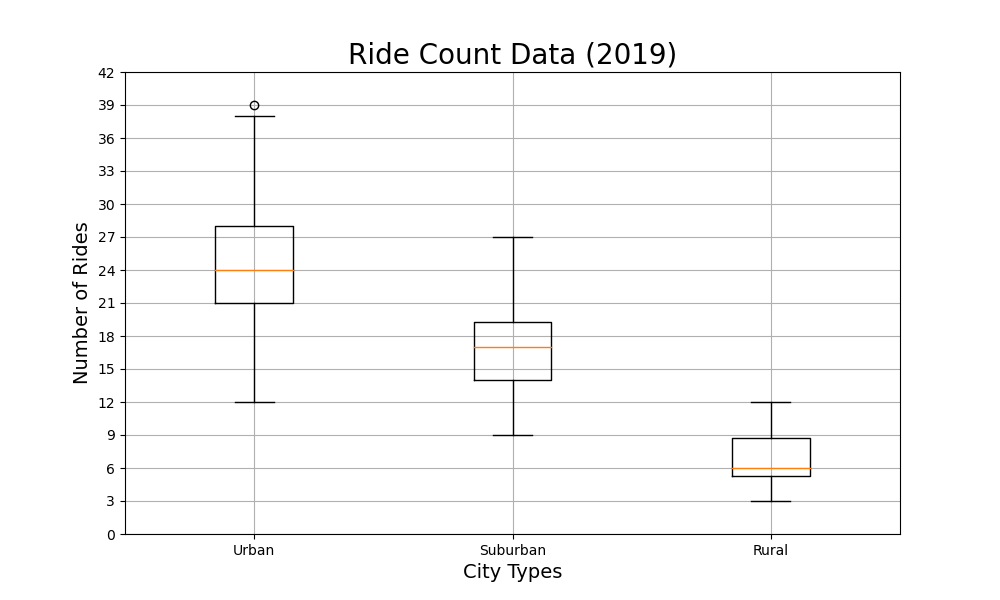

# PyBer_Analysis

## Overview of Analysis
Purpose of analysis.

## Results
Urban cities have a greater number of rides, but lower fares, while the opposite is true for rural cities. Circle size correlates with driver count, so most urban cities have more drivers than other cities. Suburban cities tend to fall in the middle of these three metrics.

The data in this bubble plot can be broken down further:

### Comparing of Rides by City Type
The box and whisker plot further shows that on average, urban cities have the most rides, rural cities have the least rides, and suburban cities fall in the middle. There is one outlier in the urban cities. West Angela has the highest ride count. The pie chart shows a large discrepancy between the number of total riders from rural and urban cities. Urban cities account for over two thirds of riders, while rural cities have over five percent of all riders.

### Comparing Fares by City Type
The box and whisker plot shows that urban cities have on average the lowest fares, while rural cities have the highest fares. The pie chart compares the percent of total fares collected from each city type. Urban cities collect almost two thirds of total fares collected despite having the lowest fares per ride. The higher average number of rides per urban city makes up for the lower fare per ride so that this city type can collectively see more profit.

### Comparing Drivers by City Type
The box and whisker plot shows that on average, rural cities have significantly less drivers than urban cities. And the pie chart shows that rural drivers account for less than three percent of all drivers. On the other hand, urban cities have over 80% of drivers.

## Summary
In sum, rural cities have less drivers, less rides, and higher fares. The higher fares may be attributed to the fact that rural cities have significantly less drivers than the other city types. It may also be good to collect data on the length of ride per city type to better understnd the discrepancies between the fares. Urban cities tend towards the opposite; they have more drivers, more riders, and lower fares. However, the third box and whisker shows that some urban cities have the same number of drivers than some rural cities. In the bubble plot, these smaller circles still correlate with more riders. It may be beneficial to launch a campaign in these urban cities with less drivers in order to encourage more people to become drivers. This would help meet the demands of the higher number of riders in these cities. If the number of drivers in these cities cannot be increased to meet the demands of the riders, it may also be necessary to consider increasing fares in these cities to maximize profit.
